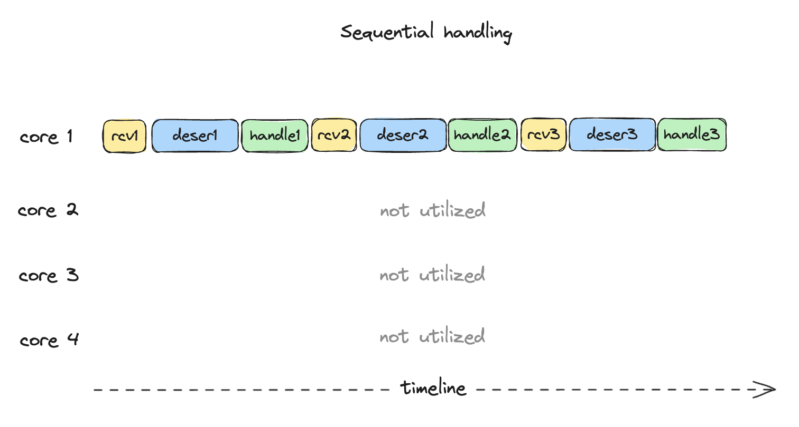
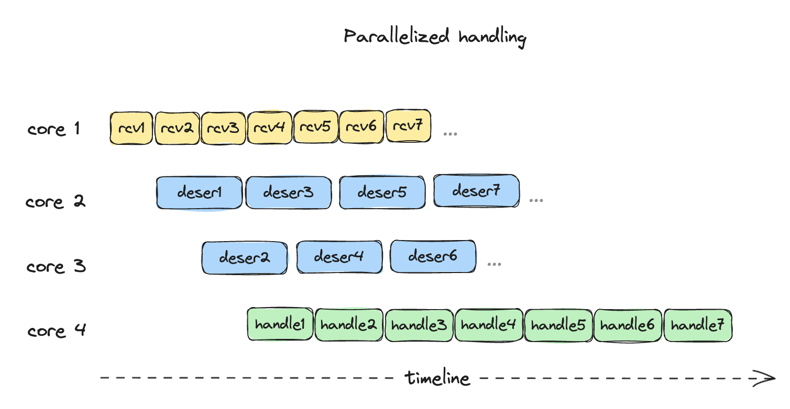
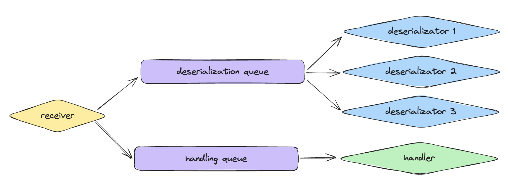

# Consumer guide

Implementation example: [testconsumer](../example-consumer)

## Client connection

In order to receive blocks, a GRPC client needs to be created. \
Use endpoint URI and don't forget the port. Go example:
```go
client, err := grpc.NewClient("myserver:4300")
```

### Non-TLS connection

Very importantly, allow connection without transport credentials (or at least make a configuration option to disable it),
that will be useful for testing and cluster-local connections. Go example:
```go
grpc.WithTransportCredentials(insecure.NewCredentials())
```

### Connection input buffer

When dealing with block consumption, which typically involves transferring large amounts of data,
it's crucial to optimize the connection's default window size, also known as the I/O buffer.
This adjustment is particularly important when the server is geographically distant from the client.
In such cases, the client may experience delays due to the time it takes for the server to receive client acknowledgments (ACKs), which can cause interruptions in the data transfer process.

By increasing the connection window size, the frequency of ACKs is reduced, as it takes longer to fill a larger I/O buffer.
This helps maintain a smoother data transfer. To ensure seamless data consumption, the buffer size should be at least equal to the amount of data transmitted during the ACK-wait period, which is determined by the connection latency:
```
buffer >= bandwidth * latency
```

For example:
```
buffer >= 30MB/s * 0.4s
buffer >= 12MB
```

A buffer size of 64 MB would be generally sufficient for most systems, even under extreme conditions.

To adjust the buffer size, two options have to be modified:
- `InitialWindowSize` - defines buffer size for single RPC call
- `InitialConnWindowSize` - defines buffer for entire connection, must be at least as big as `InitialWindowSize`

Go example:
```go
grpc.WithInitialConnWindowSize(64*1024*1024)
grpc.WithInitialWindowSize(64*1024*1024)
```

### Max message size

By default clients will return an error if incoming message is bigger than `4MB`. \
In our practice there are known blocks that even exceed `64MB`, and there's no known limit,
so it's recommended to adjust this limit to something big enough, to be prepared for such situations,
Go example:
```go
grpc.WithDefaultCallOptions(
    grpc.MaxCallRecvMsgSize(1*1024*1024*1024),
)
```

### Full example

```go
client, err := grpc.NewClient(
    "myserver:4300"
    grpc.WithTransportCredentials(insecure.NewCredentials()),
    grpc.WithInitialConnWindowSize(64*1024*1024), // 64 MB
    grpc.WithInitialWindowSize(64*1024*1024),     // 64 MB
    grpc.WithDefaultCallOptions(
        grpc.MaxCallRecvMsgSize(1*1024*1024*1024), // 1 GB
    ),
)
```

### Reconnection

Typically GRPC client libraries are handling reconnections automatically,
so most probably nothing needs to be done. However, please fact-check this
with documentation for your client library.

Automatic reconnection means that you don't need to recreate the client.
However, be aware that **it doesn't mean that RPC calls will survive
reconnection seamlessly**. If you want to guarantee the continious consumption
even despite reconnections, **your program must have logic that
would do an RPC call again** if previous one has failed at some point.

### Closing client connection

Make sure client connection is closed after it's no longer needed. Go example:
```go
defer client.Close()
```

## Calling ReceiveBlocks RPC

### Constructing request

In most cases all [fields](https://github.com/aurora-is-near/borealis-prototypes/blob/main/blocksapi/stream.proto) that program needs to specify in a request are:
- stream name
- start policy
- start target (height)

Most useful start policies are:
- `START_EXACTLY_ON_TARGET` - will start from target or fail if it's not possible.
- `START_EXACTLY_AFTER_TARGET` - will start strictly after target or fail if it's not possible.
- `START_ON_LATEST_AVAILABLE` - will start from the tip of the stream

Go example:
```go
request := &pb_blocksapi.ReceiveBlocksRequest{
    StreamName:  "v2_mainnet_aurora_blocks",
    StartPolicy: pb_blocksapi.ReceiveBlocksRequest_START_EXACTLY_AFTER_TARGET,
    StartTarget: &pb_blocksapi.BlockMessage_ID{
        Kind:   pb_blocksapi.BlockMessage_MSG_WHOLE,
        Height: 40_000_000,
    },
}
```

### Authorization

To authorize an RPC call, attach `authorization` header to the request metadata.
The value of `authorization` header must be `Bearer yourtoken123`.
Go example:
```go
md := metadata.Pairs("authorization", "Bearer mytoken123")
callCtx := metadata.NewOutgoingContext(context.Background(), md)
call, err := blocksProviderClient.ReceiveBlocks(callCtx, request)
```

### Getting responses

Once RPC method is called, you can start getting the responses.
Response handling interface will allow to distingiush if:
- The new response is there
- Stream has ended normally
- Stream ended because of some error (connection error / backend error / ...)

Go example:
```go
response, err := call.Recv()
if err == nil {
    // Got new response
} else if errors.Is(err, io.EOF) {
    // Finished normally
} else {
    // Some error
}
```

### Error handling

In case if error has happened, the response stream will no longer
produce anything. The `ReceiveBlocks` rpc call must be done again
(without need to recreate client connection).
Every consumer **must** implement re-calling logic in this place.

### Getting response headers

Response headers are guaranteed to be available right after
the first response has been received.

One useful response header is `x-reqid`, it is generated and attached by
server to every request. Can be used to match logs during debugging.

Go example:
```go
md, err := call.Header()
if err != nil {
    // Headers are still not available
} else {
    reqids := md.Get("x-reqid")
    log.Printf("x-reqid: %s", strings.Join(reqids, ","))
}
```

### Closing call

Make sure call is closed after it's no longer needed. Go example:
```go
defer call.CloseSend()
```

## Parallelization advice

Usually, if no optimization effort is done to better utilize
CPU during the block consumption, consumption can be
very slow.

Typically, the flow is the following:
```go
msg = recieveNextMessage()
block = deserializeMsg(msg)
handleBlock(block)
```

Quite obviously, CPU is not well-utilized when doing all three
things sequentially:
<p align="center">
  
</p>

In this case program waits for decoding/handling for current message
to finish before receiving/decoding the next message.

If parallelized correctly, no waiting needs to be done. In which case messages
are processed much faster:
<p align="center">
  
</p>

In this case:
1. All three processes work in parallel (receiving / deserializing / handling)
2. Multiple cores are involved in deserizalization - which is very important, because it might be the heaviest part
3. Processes are minimally blocked on each other

This can be achieved in many ways, here's just the example:

1. Receiver puts each received message into two queues
   1. deserialization queue
   2. handling queue
2. In parallel, there are running as many deserializators as the number of threads (each in it's own coroutine)
   1. Deserializator pulls message from deserialization queue
   2. Deserializes it
   3. Marks it as deserialized
3. In parallel, there is running a handler
   1. It pulls message from handling queue
   2. Waits until it is marked as deserialized
   3. Handles it

<p align="center">
  
</p>

**Note:** proper parallelization **must mandatory be done** in indexing services
that stay on critical infrastructure path
